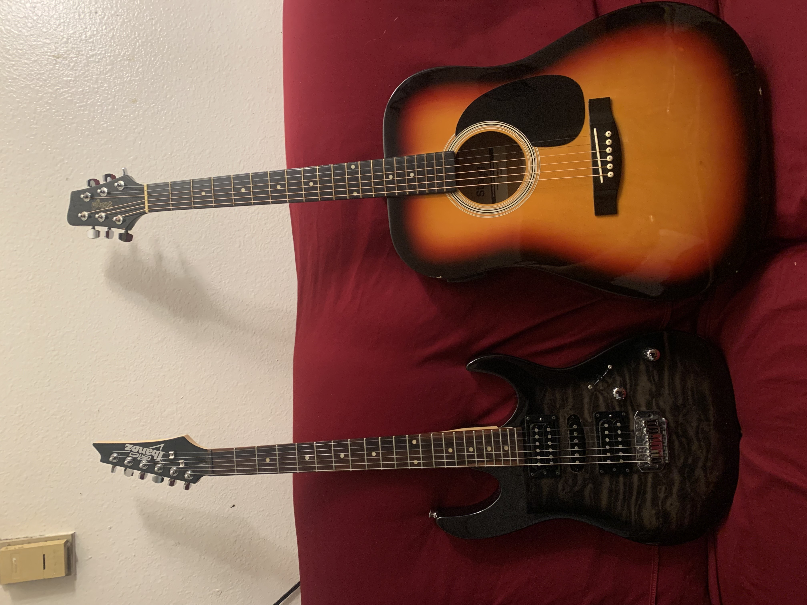

# Hello! My name is **Alan Diaz**

## About Me:
I am 3rd year transfer student and majoring in CS. I speak both English and Spanish, spanish being my strongest of the two. 

Some of my hobbies include:
- Playing guitar 
- Playing 8 Ball Pool
- [Speedcubing](https://en.wikipedia.org/wiki/Speedcubing)

## My Programming Experiences
I first started to learn to code while participating in Robotics Club. I was involved with a small group of students who participated in vex competitions and I was being trained to become the next programmer. Ever since then, I continued to reinforce my coding abilities and fouces on a few common languages.

The familiarity of the languages I know are ranked as such:
1. C++
2. Java
3. Python
   > Despite python is my weakest language I am condifident in my skills regarless

Some of the things I plan to learn from this class is how to work effectivly with a group and improve my familiarity with `git` commands and the use of `Github`

[Back to Top](#hello-my-name-is-alan-diaz)
[Check my README](./README.md)

### Current Progress
- [x] Completed my user page
- [x] Understood how to use markdown
- [x] Submitted assignment